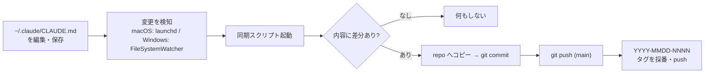
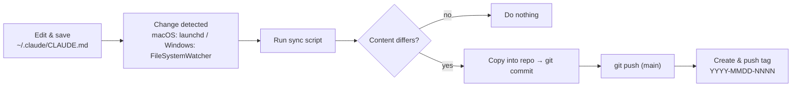

# my-claude-md

ユーザーレベルのグローバル `CLAUDE.md`（全プロジェクト共通の Claude Code 指示書）を、変更のたびに自動で公開ミラーするリポジトリ。保存すると macOS の launchd または Windows の FileSystemWatcher が変更を検知し、commit・push・日付タグの採番までを自動で行う。

A repository that auto-mirrors the user-level global `CLAUDE.md` (shared Claude Code instructions) to a public remote on every change, via launchd on macOS or a FileSystemWatcher on Windows.

**日本語** | [English](#english)

---

## 日本語

### 仕組み

監視と同期の実体（スクリプト、launchd plist、タスクスケジューラ定義）はリポジトリの外に置く。リポジトリが追跡するのは `CLAUDE.md` / `README.md` / `CHANGELOG.md` の3ファイルだけにする方針のため。

### 構成

| 要素 | macOS | Windows |
| --- | --- | --- |
| 同期スクリプト | `~/.claude/my-claude-md-sync/sync.sh` | `…\.claude\my-claude-md-sync\windows\sync.ps1` |
| 監視 | launchd `WatchPaths` (`com.4ltena.my-claude-md-sync.plist`) | `watch.ps1`（FileSystemWatcher） |
| 常駐登録 | `launchctl bootstrap` | `install.ps1`（タスクスケジューラにログオン起動で登録） |
| ローカルリポジトリ | `~/File/projects/claude/my-claude-md` | `%USERPROFILE%\File\projects\claude\my-claude-md` |

### Windows のセットアップ

`gh auth login` と git 認証（`gh auth setup-git` など）を済ませた状態で、PowerShell から `windows\install.ps1` を一度実行する。`watch.ps1` がログオン時に起動するタスクとして登録され、以降は `sync.ps1` が macOS の `sync.sh` と同じく commit・push・タグ採番を行う。

### バージョン（タグ）

タグは SemVer ではなく日付ベースで採番する。形式は `YYYY-MMDD-NNNN`。`NNNN` はその日の更新通番で、当日1回目が `0001`、2回目が `0002`、翌日また `0001` に戻る。push 成功のたびに当日のタグ数を数えて次番号を採番・push し、バージョンバッジはこの最新タグを表示する。

### CLAUDE.md の内容

全プロジェクトに適用される共通指示。主な節は次のとおり。

- **Language** 出力は必ず日本語。コード・コマンド・パス・識別子・ログはそのまま残す。
- **Post-coding completion output** 完了後に Summary / Changes / Verification / How to run / Notes / Next / Commit proposal の順で出力する書式。
- **Plan execution** 承認済みプランの実装は subagent-driven を既定とする。
- **Git / Commit and push** コミット作法（英語タイトル、`type: description`、`Co-Authored-By` トレーラー）、粒度、push 前チェック、削除・force push・直 push 禁止の安全規則、PR とリリースのフロー。
- **License** 公開物は最低 MIT、商用・大規模利用は Apache-2.0。
- **Release / Versioning** 注釈付き git タグを唯一の真実とする SemVer 運用と自動化。
- **Documentation** 公開・非公開ドキュメントの分離、文章作法、README と CHANGELOG の構成規約。

全文は [`CLAUDE.md`](./CLAUDE.md) を参照。

### 自動 push について

このシステムは変更検知のたびに承認なしで `main` へ直接 push する。`CLAUDE.md` 本来の「push 前に必ず承認」「直 push 禁止」ルールを、自動ミラーというこの用途に限って上書きしている。`CLAUDE.md` を更新するときは、個人のパス構成や名前など公開に適さない情報を新たに加えないよう注意する（同趣旨の注意書きを `CLAUDE.md` 冒頭にも記載）。

---

## English

[日本語](#日本語) | **English**

### How it works

The watchers and sync scripts (the launchd plist and the Task Scheduler definition) live outside the repository, so only `CLAUDE.md`, `README.md`, and `CHANGELOG.md` are tracked.

### Layout

| Part | macOS | Windows |
| --- | --- | --- |
| Sync script | `~/.claude/my-claude-md-sync/sync.sh` | `…\.claude\my-claude-md-sync\windows\sync.ps1` |
| Watcher | launchd `WatchPaths` (`com.4ltena.my-claude-md-sync.plist`) | `watch.ps1` (FileSystemWatcher) |
| Registration | `launchctl bootstrap` | `install.ps1` (Task Scheduler, at logon) |
| Local repo | `~/File/projects/claude/my-claude-md` | `%USERPROFILE%\File\projects\claude\my-claude-md` |

### Windows setup

With `gh auth login` and git auth (`gh auth setup-git`) already configured, run `windows\install.ps1` once from PowerShell. It registers `watch.ps1` as a logon task; from then on `sync.ps1` commits, pushes, and tags exactly like `sync.sh` on macOS.

### Versioning (tags)

Tags are date-based rather than SemVer, in the form `YYYY-MMDD-NNNN`, where `NNNN` is that day's update count (first update of the day is `0001`, the next `0002`, reset to `0001` the following day). On each successful push the script counts the day's tags and pushes the next number; the version badge shows the latest tag.

### What CLAUDE.md contains

Instructions applied to every project. Main sections: **Language** (always reply in Japanese; keep code, commands, paths, identifiers, and logs verbatim), **Post-coding completion output** (Summary / Changes / Verification / How to run / Notes / Next / Commit proposal), **Plan execution** (subagent-driven by default), **Git / Commit and push** (commit conventions, push-safety rules, PR and release flow), **License** (MIT, or Apache-2.0 for commercial use), **Release / Versioning** (annotated git tags as the single source of truth), and **Documentation** (public vs. local docs, writing style, README and CHANGELOG conventions). See [`CLAUDE.md`](./CLAUDE.md) for the full text.

### Auto-push

By design the system pushes to `main` without per-change approval, overriding the "always ask before push" and "no direct push to main" rules in `CLAUDE.md` for this mirror use only. When editing `CLAUDE.md`, avoid introducing personal paths or names that should not be public; the same note appears at the top of `CLAUDE.md`.
