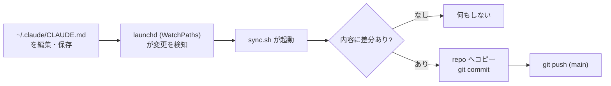

-black?logo=apple&logoColor=white)

# my-claude-md

ユーザーレベルのグローバル `CLAUDE.md`（全プロジェクト共通の Claude Code 指示書）を、変更が起きるたびに自動で公開ミラーするリポジトリ。`~/.claude/CLAUDE.md` を保存すると macOS の launchd が変更を検知し、このリポジトリへ commit と push を行う。

This repository mirrors the user-level global `CLAUDE.md` used across all Claude Code projects. A macOS launchd agent watches `~/.claude/CLAUDE.md` and auto-commits and pushes on every change. ([English summary](#english))

## 仕組み

監視と同期の実体（`sync.sh` と launchd の plist）はこのリポジトリの外に置く。リポジトリが追跡するのは `CLAUDE.md` / `README.md` / `CHANGELOG.md` の3ファイルだけにする方針のため。

| 構成要素 | 配置場所 |
| --- | --- |
| 同期スクリプト | `~/.claude/my-claude-md-sync/sync.sh` |
| launchd 定義 | `~/Library/LaunchAgents/com.4ltena.my-claude-md-sync.plist` |
| ローカルリポジトリ | `~/File/projects/claude/my-claude-md` |

`CLAUDE.md` を更新するときは、個人のパス構成や名前など公開に適さない情報を新たに加えないよう注意する。この注意書きは `CLAUDE.md` 冒頭にも記載してある。

## CLAUDE.md の内容

全プロジェクトに適用される共通指示をまとめたもの。主な節は次のとおり。

- **Language** — 思考は英語でもよいが、ユーザーへの出力は必ず日本語にする。コード・コマンド・パス・識別子・ログはそのまま残す。
- **Post-coding completion output** — コーディング完了後に Summary / Changes / Verification / How to run / Notes / Next / Commit proposal の順で出力する書式。
- **Plan execution** — 承認済みプランの実装方式は subagent-driven を既定とする。
- **Git / Commit and push** — コミットメッセージの作法（タイトルは英語、`type: description` 形式、`Co-Authored-By` トレーラー付与）、コミット粒度、push 前チェック、削除・force push・直 push 禁止といった安全規則、PR とリリースのフロー。
- **License** — 公開物には最低でも MIT、商用や大規模利用を視野に入れる場合は Apache-2.0。
- **Release / Versioning** — 注釈付き git タグ `vX.Y.Z` を唯一の真実とする SemVer 運用と、release-please / release-it による自動化。
- **Documentation** — 公開・非公開ドキュメントの分離、AI 臭さを排した文章作法、README とCHANGELOG の構成規約。

詳細は [`CLAUDE.md`](./CLAUDE.md) を参照。

## 自動 push について

このシステムは変更検知のたびに承認なしで `main` へ直接 push する。`CLAUDE.md` 本来の「push 前に必ず承認」「直 push 禁止」ルールを、自動ミラーというこの用途に限って上書きしている。

## English

`my-claude-md` keeps a public mirror of the user-level global `CLAUDE.md` (shared Claude Code instructions for all projects). On macOS, a launchd agent with `WatchPaths` detects edits to `~/.claude/CLAUDE.md`, then `sync.sh` copies the file into this repository and runs `git commit` / `git push` whenever the content actually differs. The watcher and its plist live outside the repository, so only `CLAUDE.md`, `README.md`, and `CHANGELOG.md` are tracked. By design the system pushes to `main` without per-change approval. See [`CLAUDE.md`](./CLAUDE.md) for the full instructions and [`CHANGELOG.md`](./CHANGELOG.md) for history.
